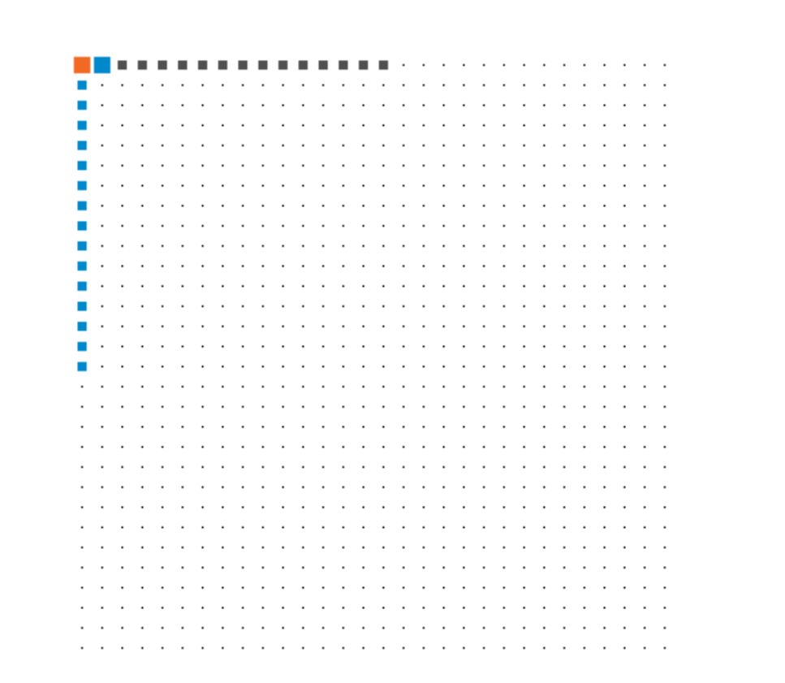
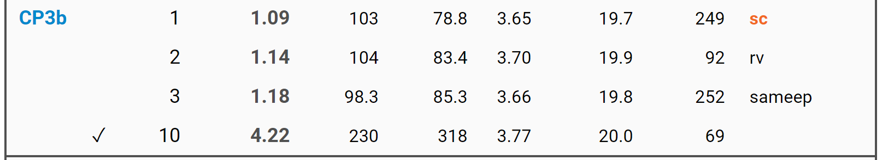
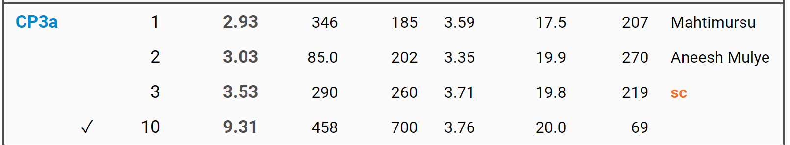
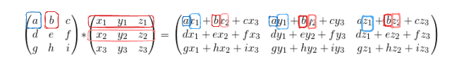

# Programming Parallel Computers

Exercises from 

Currently some #1 and Top 3 solutions on the leaderboard.

## Todos (potentially)

-   Figure out how to check the compiler type so I don't have to keep re-doing the intrinsics file switching gcc/msvc

### Correlated Pairs

-   cp3a, down to 3.5 seconds, need to add avx512 support

AVX512 permute instructions

-   `__m512d _mm512_permutexvar_pd (__m512i idx, __m512d a)`

### Median Filter

-   Hand rolled, median of medians
-   convert recursive -\> iterative
-   refactor quicksort into a separate partition function

## Updates

2023/15/7

{width="619"}

-   

2023/08/7

-   Implement float version, the fastest time! and less than 1.5; shook at 92 lines of code, 1.14, who are you rv?



2023/04/7

-   Back to avx2 but using more register re-use solidly puts me at #3 but still not below \<3 seconds

-   I can maybe get down to \< 3.0 with avx512 but it's a huge pain not being able to develop locally (...do I get a avx512 cpu just for this???? )

-   

-   

2023/03/7

-   Add avx512 support, huge pain since I don't have an avx512 cpu, shaved off 10% of time. Had a problem with unitialized variable warnings which the compiler is set to treat as an error, in the cvtps_pd instructions

2023/29/6

-   Turns out the test machines have avx512 support, which only helps a tiny bit (2c) due to memory constraints still

2023/27/6

-   Okay so turns out that 26/6 stuff was not helpful...I think I figure out why

-   In the mean time it seemed like just tuning the original vector output size to 4x3 or 4x4 was enough to drop to about 4.1 seconds, I also noticed that the test machines have avx512 support soooo probably should try that next

-   So this is the new kernel I tried, notably I did the commented out broadcast first, this had pretty large jumps especially in comparison to my typical way, so I increased register utilization but probably blew out the cache / pre-fetch

    ``` cpp
        for (int k = kStart; k < kEnd; ++k)
            for(s32 i = 0; i < Rows; ++i)
            {
                // f64x4 broadcast = BroadcastF64(&Data[DimInner * (Row + i) + k]);
                f64x4 broadcast = BroadcastF64(&DataT[DimOuter*k + (Row + i)]);
                for(s32 j = 0; j < Cols; ++j)
                {
                    f64x4 row = loadu ( &DataT [ (DimOuter * k) + (Col + j * VecWidth) ]);
                    DotProds[i][j] = DotProds[i][j] + (broadcast * row);
                }
            }
    ```

2023/26/6

-   omp dynamic was helpful....

-   Major Refactor

So currently the inner most computation does something like this:

-   We want to calculate `result[x:x+3][y:y+3]` in essentially 1 pass, because we only need to load `3n + 3n` vectors to compute `9` outputs so a `9/6n` ratio versus say `1/2n`

-   We do this in vectors so we load in (...just had a thought, not 100% sure if the loop was properly unrolled)

    ``` cpp
    x0 = Data[x + 0][k : k+8]
    x1 = Data[x + 1][k : k+8]
    x2 = Data[x + 2][k : k+8]

    y0 = Data[k:k + 8][y + 0]
    y1 = Data[k:k + 8][y + 1]
    y2 = Data[k:k + 8][y + 2]
    ```

    This [results in this asm](https://godbolt.org/#z:OYLghAFBqd5QCxAYwPYBMCmBRdBLAF1QCcAaPECAMzwBtMA7AQwFtMQByARg9KtQYEAysib0QXACx8BBAKoBnTAAUAHpwAMvAFYTStJg1DIApACYAQuYukl9ZATwDKjdAGFUtAK4sGIMxqkrgAyeAyYAHI%2BAEaYxCAAzKQADqgKhE4MHt6%2B/oGp6Y4CoeFRLLHxSXaYDplCBEzEBNk%2BfgG2mPZFDPWNBCWRMXGJtg1NLbntCmP9YYPlwwkAlLaoXsTI7BwmGgCCO/tmCWHI3lgA1CYJbtPotHjRAHQIV9gH5scMp14XV27ILCYBBeCTeew%2BJzOmEu12Q02IYWAr3eewIAE9kpgsFRzl4GOlgOF0OcwgRcQkzFcrKiMVjMDjSecFBSqQd0ZjsecqLRUECuSyEtTduy6Tj0GtovQuQA2SSs8Hgo6Qn7Qv6qAAc0tJCIYz2RCt2AHpDecRZyAPrmlhmACs0uJVFlqjlgpRwtpnPhXgc7wA7ELzoHzpbrXbiQA3eX7X0AERlkmdUbdjoTknOqExxCBJGs1CdaaYpHjzvO0SWfoDQZTJeIUaD52Ij3DMLjVtD0vNTHQ6HNyXQECYTaLT3D5dde3rxEwBHWDAgxDHQpMseT%2BfTmezxAAVHnU%2BdC8W02WKwd69W07Xx7tJ02W8GWO2rV5aL3%2B4Pw8Om4vT0GpzPiHOC5JiuBopucCBdv2577uW4L%2Bj%2BgZgVOCjPmSVxxhodZVrK5xbiIYiNHeu64eWZjSu%2BWGISQEBeBSJJ3phgr0X85wuhYlyWNYeCwdeQbLpW9aBshqEcVYCRxvhBi1jaFh4CYNoxpRlwgbxQnTrO86YChtAEN%2BcGKaBa48l2XjEVuTA8fxCGHg2SmNs26H3o%2BxnoF4r4DnpqkNupAHzp5y4GfsBoHOGqB4MSaDEFOBgEJgECMgwaJFglqhFmg%2BJktyvJklu6BAgeWV8luwk6UslxwQJ5zpdMTJ0QAajUMZ4Cwd5sdZzJmOcDXIB4eJoeJ5wQAwqiiV1jXNecAC05xcGVJrdU1LBKR15zKJBWIABp3gtE1bmNPVrIISYTkG1VkitFg8sgADWi0AJp3gkSlnbVnWXagN2LVtjlPVe9YXVd129YID2OUNaKje9n3NQ902zecJpQ7dMPLXRa3dlioMDUjwMEA9e1I/dVLlUFXlgVuEQkCwMb5UR5NLICtBXRA6NYOg%2BOret6BbXt6QAF6YKgVC7ks/knYGHzJFmwCAumLDJOcySNGI9C0FyObi%2BrxAQCtABKqAAO4McT%2BtGyxiXE9Y1imzx9ZWZrZ44UIPjG39glUdrK3ZK77HeyxrObZbnGWNktvu8plXh/G5zhmIRF%2B9c5zDWVVwAGLnHlDTyRYw1bqbo3ZPJcYgOcjGR%2BHlPENT%2BXZwH3N54bBeeEXd6x7QSlR87LVWwNbcd3xKnWY7aYALKYIYd5d4aw394hTs%2BEIACOPtD1W1Fe54PvnAnbhJ6oQdWCHnhh%2B79teVHYFt3elfV1nMl1xtDdm5Y2/NwpU3nGPhiz4JN803fFgH5Pybu3d%2Bjk%2B5uyjoGLuS9RLgLEFuCB5cJaDwdthNMABJBg4Z6jszvFwQ0ChF5NAgDAxenkL7rzognDCxMd57wPtYUOq8UHIN/lTf%2BTBa5c0fvnawr9QFxi3I5LBOCCDsx/gFayUjNbSKOFLJgMsmBywVkrLMTNOha2svwT2dE%2BEDQtkxfRu8653UYZYG20j4JoI9jrahm9HJlwETCExPDzEWGYTYiOLD2FV04dwjG9c%2BEv0LmAgaZcfEyK8lEt09ZjSmgQNCNYBBkheDJPgJasj5HS1lqgeWitlYaLVjopOhsmCEG0VQzq%2BjaFGMbubNEJtDY9xjITGGJ9vFeJ0XYzqNDAymzoQ4xOhjfbN04uJNpLANodLttY8%2B4doIxlQAQZQxAMAKGzpMsxClNmAy%2Bi3RyVkVxXh8WeKp%2B0MHoBGo44m3VLnXMTg/W5NR7lwIGjtFgMzw5nygQs85eAt4ApYls9x3FTnfLmb8353SVraC3nC4FezmobXcdoL5UKB5sIxRfNcDy4wuVMruLcSwIB/1pvwoBEBgnsW4qNO5VzRY/2xQstcENHIEqgCmYlpKOHkpfpSv2L80V0peQyihzLsVLJWWs9AGyZJyR2TJbQByBpStWes7OCrFJKoOS/CAI09ponFRKgegUTVRIleClBZqoWxKhTCuiQLwnEydbvEFTEraWDBV42ZWK/m6M6gi51TEg1uqRVM1F6KoE/JNUGPAwsqX1Jfq6pORqOLSnMNKQagr2KhtTYyn1trIWxvdiVAg2dEo7mpSSFOeqc3nDRSquMEFuwQDVTKuVski7Z2VQpY1saLWWpUhiwdp9h2mu0VOOKZKGj%2BRUhwFYtBOA2l4H4DgWhSCoE4G4T17EFBrA2KqI4PBSAEE0AulY10QA2gSI8X00oNBmHVAEMwXAuA2nfQATn0JwSQq7z2bs4LwBQIBAhnvXQu0gcBYBIDQPLOgcRyCUDg8kBD8RgBcASFwUgWBwx4E2HVPAmADYAHlMRrpPTQHScQQMQGiAB6IYRGhok4CexjzBiBohI9EbQNRwMnrg2wQQJGGC0BYxBnDmBoheGAG4FWIHuC8CwICIw4gJP4CnLUcMWkAOYFUDUNJWwT2kk6AB%2B40QsycY8FgADBAEQsFY5B7kiiFCEeI2RxgjmZCCEkuwKQ3n5BKDUAB3QSQDBGBQLu/QDwQOQBWBmboCnJokYSFNQEGwQQxmYI4bTvBUDaaiuFHTcWOhdEyC4Bg7hPCtBAJIbDIQ5hlAqIkTUKQ0gZAEBMPwdW2uFEyAMJrixWvVFqAIXo4xqu5GwyN7o43ZilCGJUX0gRph9C63oVbTQBuLcSMtlY%2B71ibAkIu5d/6JNbo4OcDU0pJo4WAMgZAM1b1cEGrgQgJAOJYaWLwcDWhRakCvZIaUjwjift9FwX0YP1TqkkDDswP6OB/tIGujdF3gOgdPee/7S6OBmF4A5rgGhAgo7y0BzHEH/sFfSM4SQQA%3D%3D) where we can see the 6 loads and 9 FMAs

``` cpp
.L42:
        vmovupd ymm0, YMMWORD PTR [r9+rax*8]  // load0
        vmovupd ymm3, YMMWORD PTR [rsi+rax*8] // load1
        vmovupd ymm2, YMMWORD PTR [rcx+rax*8] // load2
        vmovupd ymm1, YMMWORD PTR [rdx+rax*8] // load3
        vfmadd231pd     ymm4, ymm0, ymm3
        vfmadd231pd     ymm13, ymm0, ymm2
        vfmadd231pd     ymm12, ymm0, ymm1
        vmovupd ymm0, YMMWORD PTR [r8+rax*8] // load4
        vfmadd231pd     ymm6, ymm3, ymm0
        vfmadd231pd     ymm10, ymm2, ymm0
        vfmadd231pd     ymm9, ymm1, ymm0
        vmovupd ymm0, YMMWORD PTR [rdi+rax*8] //load5
        add     rax, 4
        vfmadd231pd     ymm5, ymm3, ymm0
        vfmadd231pd     ymm8, ymm2, ymm0
        vfmadd231pd     ymm7, ymm1, ymm0
```

Okay so the issue now is that we're entering a memory bottleneck with larger sizes. We really need to up our computations per memory loads. It's easiest to see this by examining how matrix multiplies use element of the respective matrices.

From Eli Bendersky's [Visualizing matrix multiplication as a linear combination](https://eli.thegreenplace.net/2015/visualizing-matrix-multiplication-as-a-linear-combination/) we see that a column of the output is generated by a linear combination of the columns of the left matrix

but if we focus on a single element `a` we can also think of it as



-   any element of the right matrix participates in `ny` elements of the output
-   any element of the right matrix is multiplied by every element of a column of the left matrix
-   we locate that column by the row of the element

We can also think of this in a row oriented manner

-   any element of the left matrix participates in every element of a row of the right matix

-   we locate that row based on the column of the element.

So now our new strategy is to load in a single element of the left matrix

``` cpp
//EXTEMELY rough sketch
f64 data[16][4] = 
{
    0,1,2,3,
    4,5,6,7,
    8,9,10,11,
    12,13,14,15,
    0,1,2,3,
    4,5,6,7,
    8,9,10,11,
    12,13,14,15,
    0,1,2,3,
    4,5,6,7,
    8,9,10,11,
    12,13,14,15,
    0,1,2,3,
    4,5,6,7,
    8,9,10,11,
    12,13,14,15,
};

f64 data2[4][16] = 
{
    0,1,2,3,4,5,6,7, /*  */   8, 9, 10, 11, 12, 13, 14, 15,
    0,1,2,3,4,5,6,7, /*  */   8, 9, 10, 11, 12, 13, 14, 15,
    0,1,2,3,4,5,6,7, /*  */   8, 9, 10, 11, 12, 13, 14, 15,
    0,1,2,3,4,5,6,7, /*  */   8, 9, 10, 11, 12, 13, 14, 15,
};

f64 result[16][16] = {};

void kernel(f64* NormData, s32 Row, s32 Col)
{
    f64x4 DotProds[2][2] = {}

    for (int k = 0; k < nx; ++k)
    {
        f64x4 broadcast = Broadcast(data[0][k])

        f64x4 row0 = loadu(data[k][0:7])

        DotProds[0][0] += broadcast + row0;

        f64x4 row1 = loadu(data[k][8:16])   

        DotProds[0][1] += broadcast + row1;
    }
}
```

2023/25/6

-   cp3a blocking is working but still really slow, the gflops going down suggests I'll have to do some sort of blocking to get this to work
-   
-   cp2b omp parallel
-   cp2c was confused why `VecNormData[PaddedX*Row + VecIdx]` wasn't working but the array width now changes to `VecNormData[VecCount*Row + VecIdx]` ...just kidding this actually crashes for some reason? Unaligned loads?

2023/24/6

-   Mf2 OMP parallel version, currently fastest solution, no idea why though...
-   cp1, cp2, sequential and ILP, tried ILP on the processing phase, seems to slow things down

2023/23/6

-   Median Filter sequential, had some issues getting QuickSelect working, should do a more in-depth write up
-   Turns out I could just use nth_element which is way faster

## Sources

-   2D median filter w/ Linear Time Median Find using QuickSelect
    -   Quicksort partition, <https://en.wikipedia.org/wiki/Quicksort>

    -   QuickSelect, <https://en.wikipedia.org/wiki/Quickselect>

Based on [Jukka Suomela's](https://jukkasuomela.fi/) materials at <https://ppc.cs.aalto.fi/ack/> Creative Commons [**Attribution 4.0 International**](https://creativecommons.org/licenses/by/4.0/) (CC BY 4.0).
